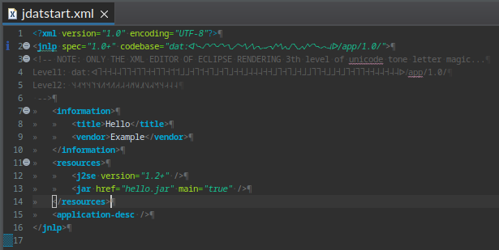

# Tone Letter Hex

Using alternative untype-able letters to encode hex values;

	/// Dīpāvalī Hex format in chinees tone letters to light up the path in the unlimited matrix.
	public static final OctoBitConverter<String> HEX_DIPAVALI = new OctoConvStringHexUtf8(new String[] {
			"˧˥˩","˧˩˥","˧˥˦","˧˩˨","˧˦˦","˧˨˨","˧˥˥","˧˩˩","˥˩˧","˩˥˧","˥˦˧","˩˨˧","˦˦˧","˨˨˧","˥˥˧","˩˩˧"
	}); // note: In real unicode renderer this (_LRPATH) renders as a single glyph per hex nibble.

## Tone Letter Level 1 to Level 2 Magic

0p = ˧ ˥ ˩ → ˧˥˩  
1n = ˧ ˩ ˥ → ˧˩˥  
2p = ˧ ˥ ˦ → ˧˥˦  
3n = ˧ ˩ ˨ → ˧˩˨  
4p = ˧ ˦ ˦ → ˧˦˦  
5n = ˧ ˨ ˨ → ˧˨˨  
6p = ˧ ˥ ˥ → ˧˥˥  
7n = ˧ ˩ ˩ → ˧˩˩  
Xp = ˥ ˩ ˧ → ˥˩˧  
Xn = ˩ ˥ ˧ → ˩˥˧  
Yp = ˥ ˦ ˧ → ˥˦˧  
Yn = ˩ ˨ ˧ → ˩˨˧  
Zp = ˦ ˦ ˧ → ˦˦˧  
Zn = ˨ ˨ ˧ → ˨˨˧  
Tp = ˥ ˥ ˧ → ˥˥˧  
Tn = ˩ ˩ ˧ → ˩˩˧  

## Tone Letter 3th Level Magic

	<?xml version="1.0" encoding="UTF-8"?>
	<jnlp spec="1.0+" codebase="hyper:ᐊ˥˧˧˨˨˥˥˧˥˥˧˧˥˥˧˦˦˩˩˧˥˦˧˥˩˧˥˩˧˧˩˨˨˨˧˧˩˥˧˥˩˧˩˩˥˥˧˩˩˧˩˥˧˥˥˧˧˨˨˧˨˨ᐅ/app/1.0/">
	<!-- NOTE: ONLY THE XML EDITOR OF ECLIPSE RENDERING 3th level of unicode tone letter magic...
	Level1: hyper:ᐊ˥˧˧˨˨˥˥˧˥˥˧˧˥˥˧˦˦˩˩˧˥˦˧˥˩˧˥˩˧˧˩˨˨˨˧˧˩˥˧˥˩˧˩˩˥˥˧˩˩˧˩˥˧˥˥˧˧˨˨˧˨˨ᐅ/app/1.0/
	Level2: ˥˧˧˨˨˥˥˧˥˥˧˧˥˥˧˦˦˩˩˧˥˦˧˥˩˧˥˩˧˧˩˨˨˨˧˧˩˥˧˥˩˧˩˩˥˥˧˩˩˧˩˥˧˥˥˧˧˨˨˧˨˨
	 -->
		<information>
			<title>Hello</title>
			<vendor>Example</vendor>
		</information>
		<resources>
			<j2se version="1.2+" />
			<jar href="hello.jar" main="true" />
		</resources>
		<application-desc />
	</jnlp>
